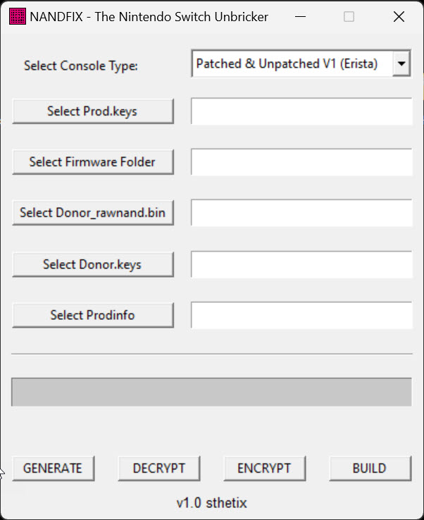

# ⚠️ ARCHIVED — THIS PROJECT IS NO LONGER MAINTAINED

**This repository has been archived and is no longer actively developed or supported.**

NANDFIX is outdated and not suitable for today's use cases. Users have reported numerous issues that will not be fixed here. You should use the newer, improved version instead:

**USE NANDFIX PRO:** [https://github.com/sthetix/NANDFixPro](https://github.com/sthetix/NANDFixPro)

NANDFix Pro is the actively maintained successor to this project, with better support, fewer issues, and improvements designed for modern use cases. Please head there for all future use and support.

---

# NANDFIX - The Nintendo Switch Unbricker

  

NANDFIX is a versatile tool designed to unbrick, rebuild, or upgrade Nintendo Switch consoles. It features a graphical user interface (GUI) powered by the **EmmcHaccGen** and **NxNandManager** cores, making complex tasks like NAND generation, decryption, encryption, and rebuilding straightforward and accessible. NANDFIX serves as a user-friendly front end, designed to reduce errors and streamline operations compared to using command-line tools alone.

## Features

* **NAND Generation (GENERATE):** Uses the EmmcHaccGen core to create NAND partitions and files based on the provided `prod.keys` and firmware version.
* **NAND Operations:** Powered by NxNandManager, these functions allow you to **DECRYPT** donor NAND partitions with `donor.keys`, **ENCRYPT** them with `prod.keys`, and **BUILD** them into a new, functional NAND.

## Prerequisites

Before using NANDFIX, ensure you have the following:

* **Operating System:** Windows 7 or higher.
* **.NET Desktop Runtime 7.0.20:** Download and install it [here](https://dotnet.microsoft.com/en-us/download/dotnet/7.0).
* **`prod.keys`:** Extracted from your console using the Lockpick_RCM payload.
* **Firmware Files:** Available from sources like darthsternie.net or sthetix.info.

## Usage

> **Important:** Make sure the NANDFIX application is in the same directory/folder as your `donor_rawnand.bin`.

1.  **Launch NANDFIX:**
    * Double-click `NANDFIX.exe` to start the application.

2.  **Select Console Type:**
    * Choose between `Patched & Unpatched V1 (Erista)` and `V2, Lite, OLED (Mariko)`.

3.  **Select Necessary Files:**
    * Use the GUI to select your `prod.keys`, firmware folder, `donor_rawnand.bin`, `donor.keys`, and `prodinfo`.

4.  **Choose an Operation:**
    * **GENERATE:** Creates NAND partitions and files using the EmmcHaccGen core.
    * **DECRYPT, ENCRYPT, and BUILD:** Decrypts donor NAND partitions, re-encrypts them for your specific console, and compiles them into a new NAND using NxNandManager.

## Credits

NANDFIX is built on the powerful cores of these key projects:

* **EmmcHaccGen:** [github.com/suchmememanyskill/EmmcHaccGen](https://github.com/suchmememanyskill/EmmcHaccGen)
* **NxNandManager:** [github.com/eliboa/NxNandManager](https://github.com/eliboa/NxNandManager)

### Support My Work

If you find this project useful, please consider supporting the development!

